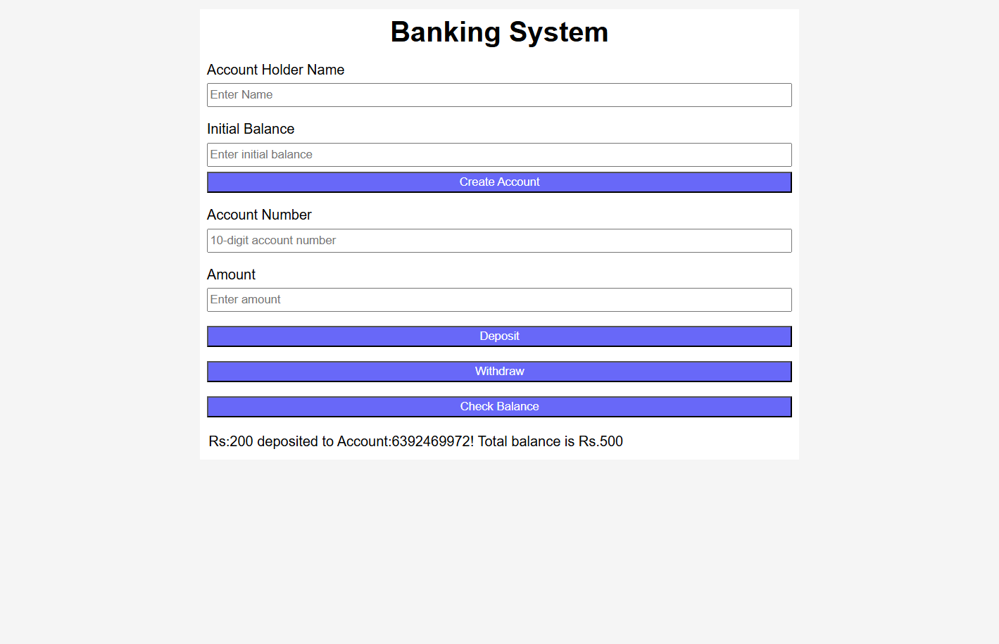
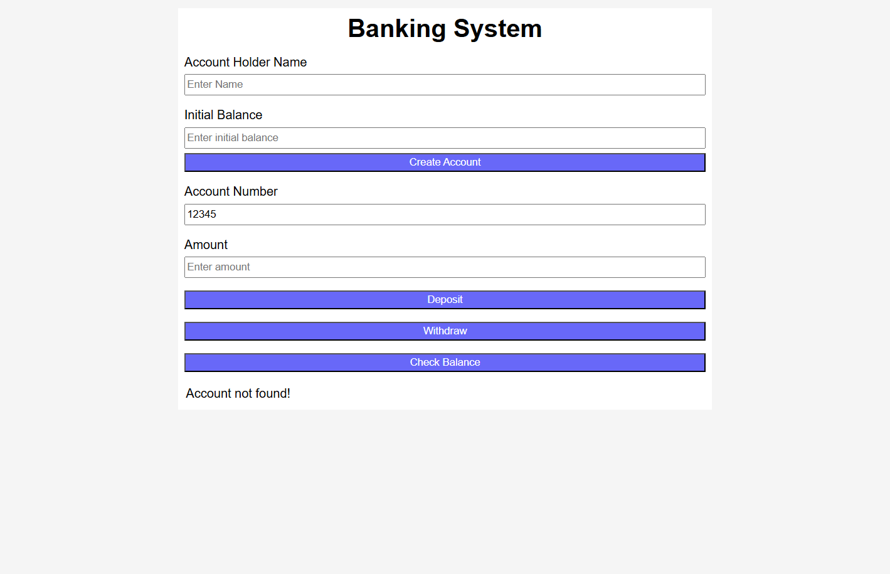

# AdvanceBankingSystemApplication
Advanced Banking System Application built with HTML, CSS, and JavaScript featuring account creation, deposits, withdrawals, balance inquiries, and transaction validation.

- [Live](https://advancebankingapplication.vercel.app)
## Table of Contents
- [Features](#features)
- [Tech Stack](#tech-stack)
- [Screenshots](#screenshots)
- [Deployment](#deployment)
- [Author](#author)

  ## features
- Create new bank accounts
- Deposit money into existing accounts
- Withdraw funds
- View account balances
- Account number validation
- Hidden balance protection without valid account access
- User-friendly banking interface
- Responsive design

  ## Tech-stack
  - HTML
  - CSS
  - JaqvaScript
 
  ## screenshots
  ### Home Page
  

  ### Account validation
  

  ## Deployment
  The applic ation is deployed and hosted on vercel
  - Live Demo: https://advancebankingapplication.vercel.app

  ## author
  Sukhwinder kaur
